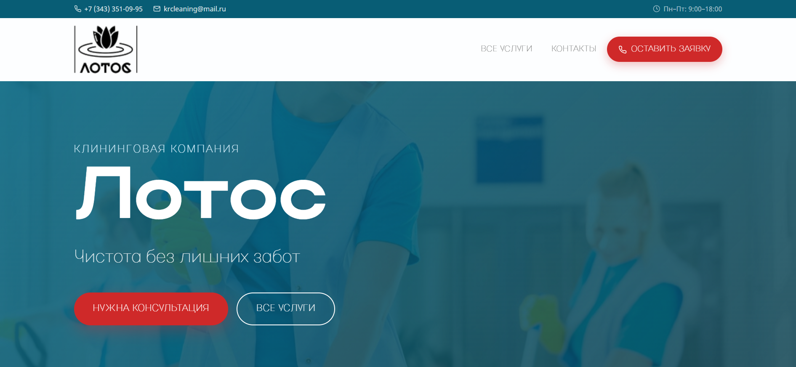
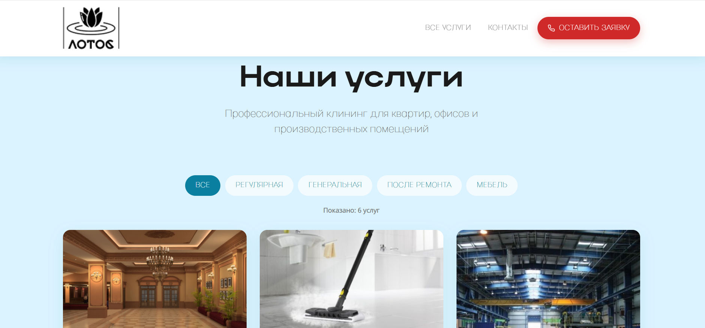
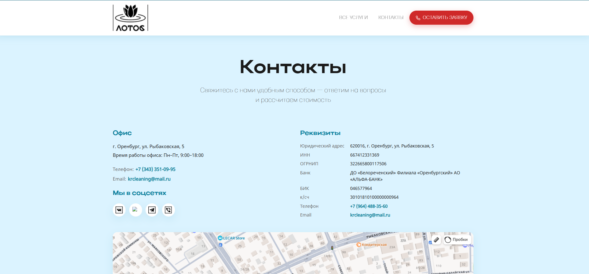

# Cleaning Company

Многостраничный адаптивный сайт клининговой компании «Лотос», свёрстанный с нуля на чистых HTML, CSS и JavaScript — без фреймворков, препроцессоров и сторонних библиотек.

## 🔗 Открыть сайт
**[→ Посмотреть живой сайт](https://angelina557744.github.io/cleaning-company/)**

## 🛠 Стек технологий

- **HTML5** — семантическая разметка (`header`, `nav`, `main`, `section`, `article`, `aside`, `footer`, `address`, `dl`), ARIA-атрибуты
- **CSS3** — Flexbox, CSS Grid, CSS-переменные, медиа-запросы, `clamp()`, `prefers-reduced-motion`
- **JavaScript (Vanilla)** — без библиотек и фреймворков
- **Инлайн-SVG** — иконки без внешних библиотек
- **Яндекс.Карты** — встроенная карта на странице «Контакты»
- **Локальные шрифты** — Actay Wide, Actay Condensed, Noto Sans через `@font-face`

## 📄 Страницы проекта

- **Главная** — hero с параллаксом, о компании, счётчики статистики, слайдер «До/После», шаги заказа, CTA-форма
- **Услуги** — карточки с фильтрацией по категориям и счётчиком найденных услуг
- **Заявки** — две формы (заказ услуги и консультация) + сайдбар с контактами
- **Контакты** — адрес, реквизиты, соцсети, встроенная карта

## ✨ Что реализовано

- Фиксированная шапка с верхней сервисной панелью (телефон, email, режим работы)
- Симметричное меню с CTA-кнопкой «Оставить заявку»
- Бургер-меню с выезжающим оверлеем и блокировкой скролла
- Hero-секция с параллаксом, градиентным оверлеем и анимированной стрелкой прокрутки
- Сетка из шести счётчиков-статистик с анимацией накрутки чисел через **Intersection Observer**
- Слайдер «До/После» с автопрокруткой, стрелками, точками и остановкой на hover
- Блок «Как заказать» из трёх шагов
- Секция CTA с формой обратного звонка
- Фильтрация карточек услуг по категориям (регулярная, генеральная, после ремонта, мебель)
- Счётчик найденных услуг
- Две формы заявок с валидацией на нативном JavaScript
- Маски телефона
- Вывод сообщений об успехе и ошибках
- Появление секций при скролле
- Универсальная обработка всех форм заявок
- Кнопка «Наверх»
- Футер с логотипом, навигацией и соцсетями

## 🏗 Архитектура стилей

Стили организованы в единый `style.css`:

- CSS-переменные для цветов, отступов, типографики
- БЭМ-подобная методология именования классов
- Адаптив от 320 до 1920 пикселей через медиа-запросы на 1024, 768 и 480 пикселей
- Поддержка `prefers-reduced-motion`
- Оптимизированная типографика на `clamp()`
- Семантическая HTML-разметка с ARIA-атрибутами

## 📱 Адаптивность

- Мобильные: 320–480 px
- Планшеты: 480–1024 px
- Десктоп: 1024–1920 px

## 🎯 Что демонстрирует проект

- Адаптивная вёрстка по макету без конструкторов
- Flexbox и CSS Grid для сложных раскладок
- Интерактивные UI-компоненты на чистом JavaScript (слайдер, счётчики, фильтры, формы, бургер-меню)
- Работа с Intersection Observer для анимации появления и накрутки чисел
- Валидация форм и маски телефона без сторонних библиотек
- Интеграция Яндекс.Карт
- Переиспользуемая CSS-архитектура на переменных
- Семантическая разметка с ARIA-атрибутами
- Локальное подключение шрифтов через `@font-face`

## 💡 Что было сложным

- Слайдер «До/После» с автопрокруткой, стрелками, точками и остановкой на hover на чистом JS
- Счётчики с анимацией накрутки чисел через Intersection Observer
- Валидация форм и маска телефона без библиотек
- Единый CSS-файл с БЭМ-подобной архитектурой при таком количестве секций

## 📜 Лицензия

Проект создан в учебных целях. Все права на контент и товарные знаки принадлежат их владельцам.
